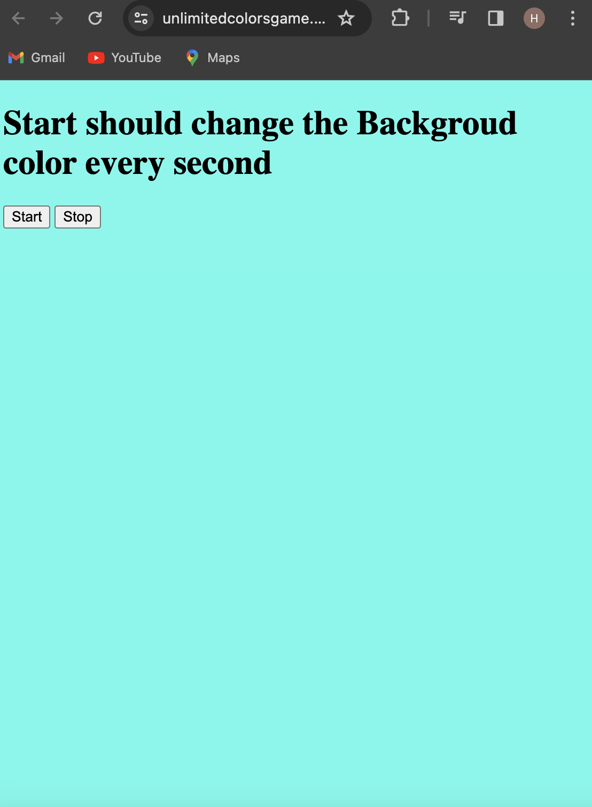

### Unlimited Colors Game Project Documentation :

### Introduction :

The Unlimited Colors Game is a web application designed to provide users with an engaging and visually stimulating gaming experience. This project aims to challenge players to match colors in a dynamic and unlimited game environment.



### You can Check it Live on Below Link :

[Live Link !](https://unlimitedcolorsgame.netlify.app/)


### Features
1. Unlimited Colors: The game generates a continuous stream of colors for players to match.

2. Time Limit: Players have a specified time limit to match colors.

3. Score Tracking: The game keeps track of the player's score based on successful color matches.

4. Responsive Design: The application is designed to work across various devices and screen sizes.

### Technologies Used
1. Frontend: HTML, CSS, JavaScript
2. Deployment: Netlify


### Installation

1. Clone the repository:

```
git clone https://github.com/your-username/unlimited-colors-game.git


```

2. Navigate to the project directory:

```
cd unlimited-colors-game


```

3. Open the index.html file in a web browser.

### How to Play :

1. Open the Unlimited Colors Game in a web browser.
2. Start the game to begin the color matching challenge.
3. Match the presented color with the corresponding color from the color palette.
4. Score points for each successful match.
5. Continue playing until the time limit runs out.


### Game Mechanics
Provide a brief overview of the game mechanics, including how points are scored, the time limit, and any other relevant details that impact gameplay.

#### Customization
Users can customize the game by modifying the color palette, time limit, or introducing new game mechanics. The codebase is designed to be accessible for customization.

### Contributing
If you would like to contribute to the project, follow these steps:

1. Fork the repository.
2. Create a new branch for your feature or bug fix.
3. Make changes and submit a pull request.